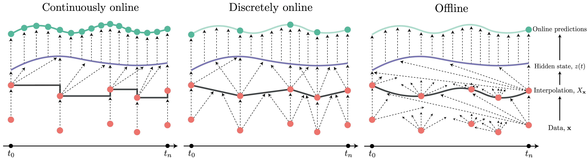

<h1 align='center'>Neural Controlled Differential Equations for Online Prediction Tasks</h1> <br>
    [<a href="https://arxiv.org/pdf/2106.11028.pdf">arXiv</a>] </h1>

## Overview
<p align="center">
    
</p>

Neural controlled differential equations (Neural CDEs) are state-of-the-art models for irregular time series. However, due to current implementations relying on non-causal interpolation schemes, Neural CDEs cannot currently be used in online prediction tasks; that is, in real-time as data arrives. This is in contrast to similar ODE models such as the ODE-RNN which can already operate in continuous time.

Here we introduce and benchmark new interpolation schemes, most notably, rectilinear interpolation, which allows for an *online everywhere* causal solution to be defined. This code will reproduce the tables seen in the paper which demonstrates that Neural CDEs can also be considered as SOTA irregular time series models for online prediction tasks.

-----
## Reproducing the Experiments

### Setup the Environment
Create a new environment with `python==3.9`, earlier versions of python will not work. The environment is built with `pbr`. First, a git repo must be initialised and tagged. 
```
git init
git add .
git commit -m "First commit"
git tag v0.0.1
```
then we can run
```
pip install -e .
```
to install the requirements and add the `src` directory to the path. 

This repository also relies on modified versions of the `torchdiffeq` and `torchcde` libraries. These live in `modules/` and need also to be installed with
```
pip install modules/torchdiffeq
pip install modules/torchcde
```

### Downloading the regular datasets
Initialise empty folders in `data/raw` and `data/processed`. To download the regular datasets run the specified download script in `/get_data/download`. Note that the Beijing datasets are part of the TSR archive, and hence the file is named `tsr.py`.

To process, run the script with the same name in `get_data`

### Downloading MIMIC-IV
The steps for processing the MIMIC-IV dataset are as follows

1. Get access by completing the human subjects research training course -> https://mimic.mit.edu/iii/gettingstarted/ 
2. Run the saved query `get_data/mimic-iv/query.sql` on the data. This can be run either in googles bigquery or in sql if the dataset is downloaded locally. Save the output to `data/raw/raw_combined.csv`.
3. Run `get_data/mimic-iv/build_raw.py`.
4. Run `get_data/mimic-iv/prepare.py`.

The processed datasets will now be saved in `/data/processed`

### Setup a MongoDB instance
Experiments are run and saved into a MongoDB. We used the Mongo ATLAS service which can be adapted to your own cluster by setting the `ATLAS_HOST` variable in `experiments/variables.py`. If a different mongodb is wanted (for example local), simply modify the `get_client` function in `experiments/utils.py`.

### Run the Experiments
Navigate to `experiments`, run python and in the shell run
```
import runs
runs.run(CONFIGURATION_NAME, gpus=GPU_LIST)
```
and thus will run for the configuration name in parallel over the GPUs in GPU_LIST. 

To reproduce the tables from the paper the configurations `hyperopt`, `interpolation`, `medical-sota` must be run. `hyperopt` (for obvious reasons) must be run first. 

The runs took us around 3 weeks in total to complete spread over multiple GPUs, so it is not recommended to try to reproduce everything. Instead, modify the configuration file and subselect only the datasets of interest.

Tables can be reproduced once the runs are complete by running `experiments/analyse.py`. However, this has not been tested for only subsets of completed runs and therefore is liable to break.

## Citation

```bibtex
@article{morrill2021neuralcontrolled,
  title={Neural Controlled Differential Equations for Online Prediction Tasks},
  author={Morrill, James and Kidger, Patrick and Yang, Lingyi and Lyons, Terry,
  journal={arXiv preprint arXiv:2106.11028},
  year={2021}
}
```
